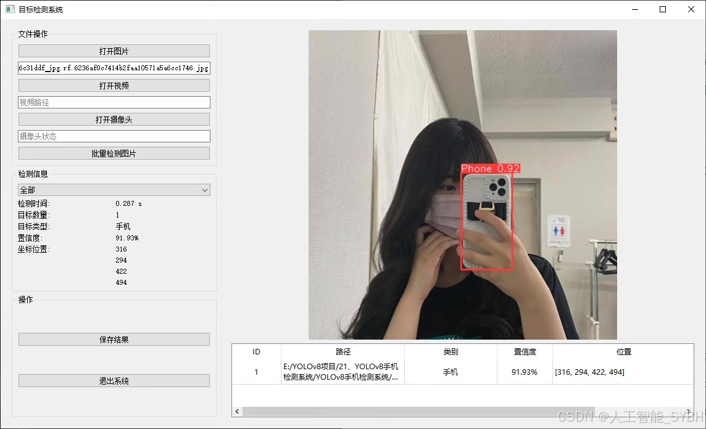
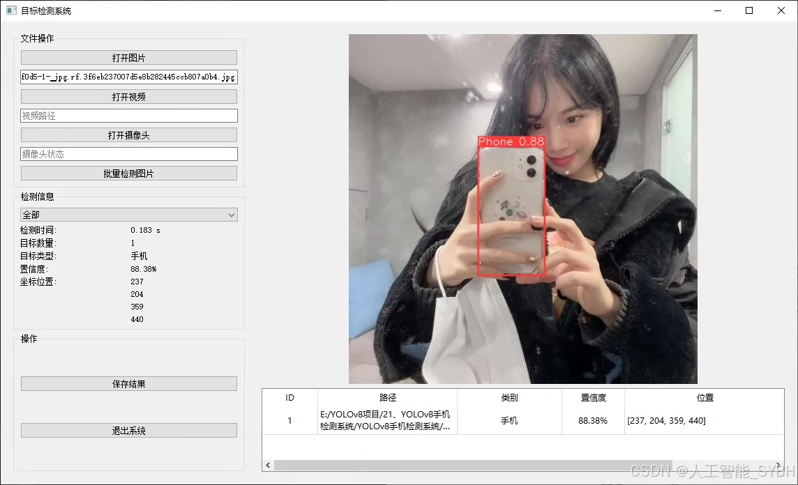
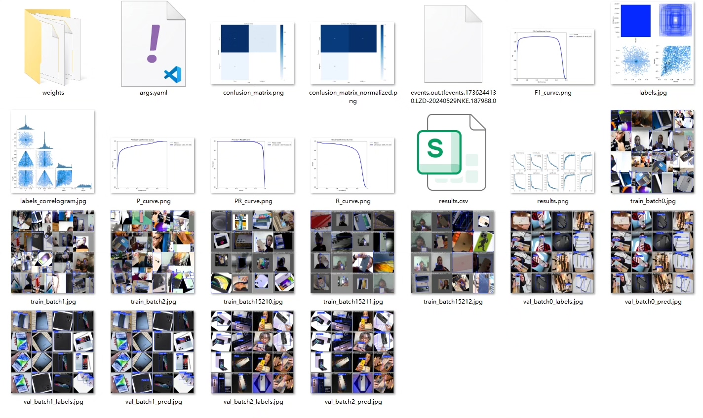
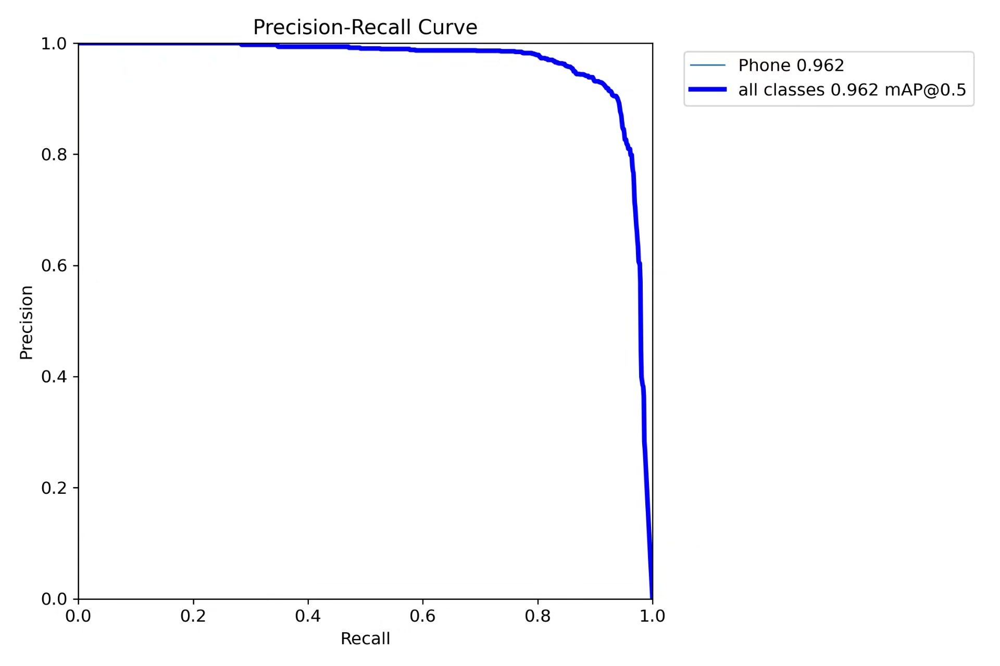
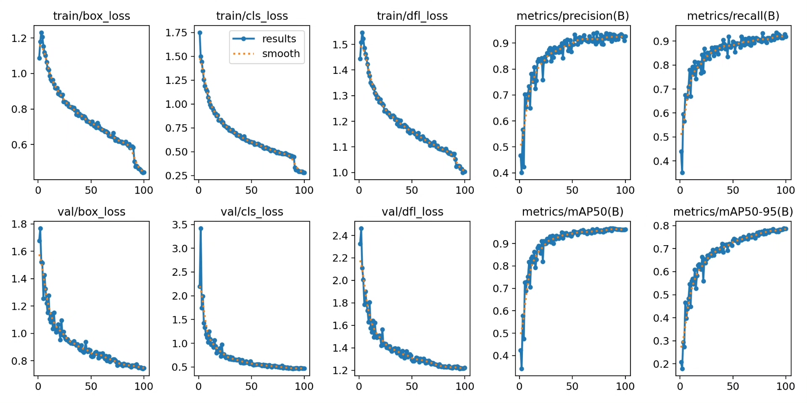
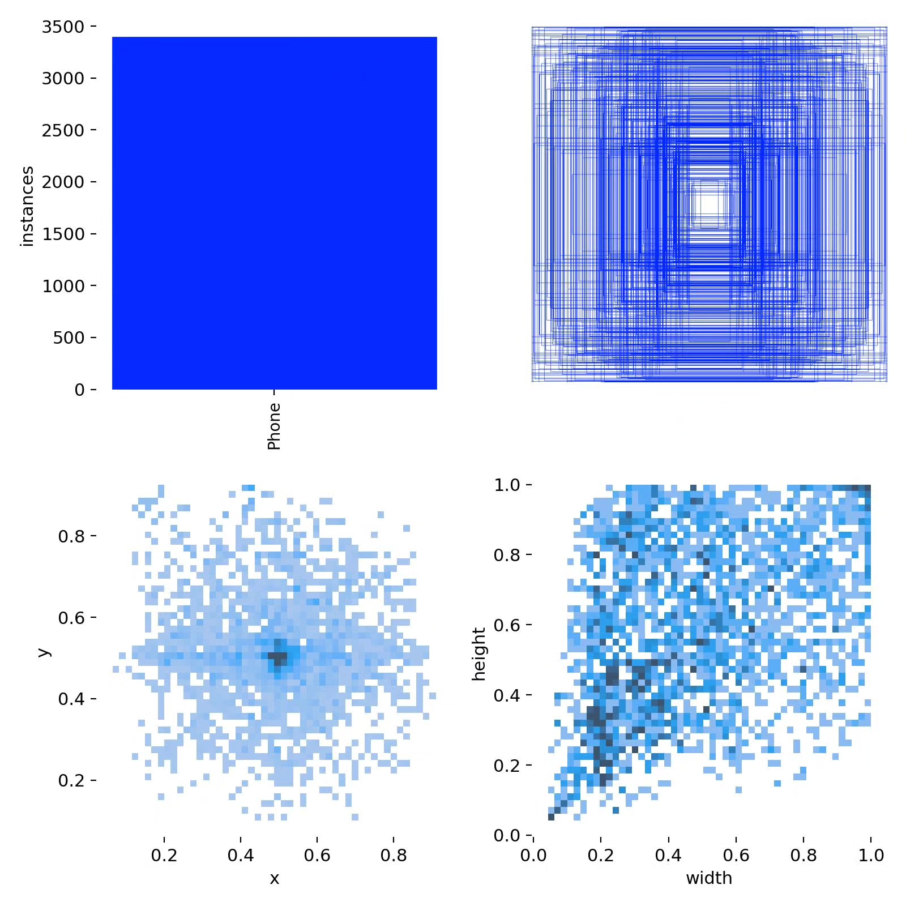
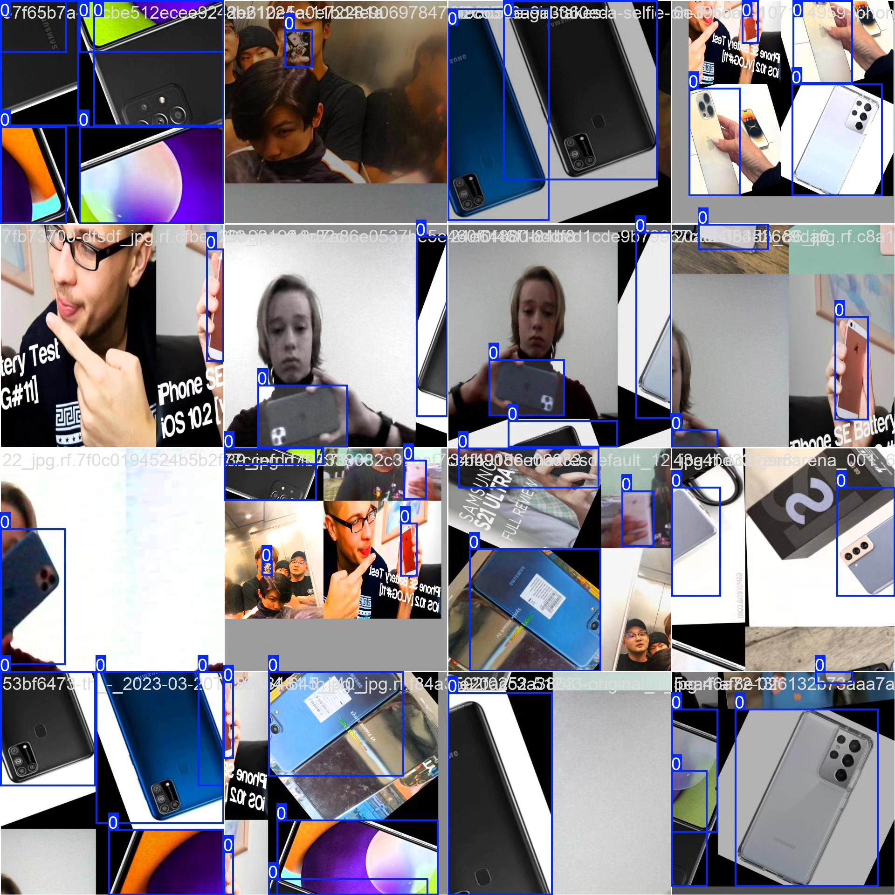
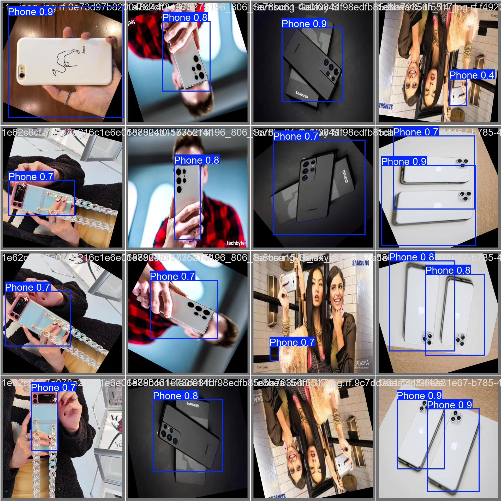

# YOLOv8-based deep learning phone detection system (YOLOv8+YOL)

## Body

Based on the advanced YOLOv8 object detection algorithm, this project has developed a smart visual system specifically for mobile device detection. The system is optimized for training on a single target category (Phone) and uses a dataset of 3500 images (2700 training images and 800 validation images). Through deep learning technology, the system can detect mobile devices in image or video streams in real-time with high accuracy and fast speed. The project is implemented using the PyTorch framework and supports various deployment methods, including mobile and embedded device deployment, which can be widely applied in many scenarios such as security monitoring, examination supervision, driving safety, etc.

The company's products have obtained the official commercial license certification from YOLO.

We provide after-sales service.

After payment, we will provide a WeChat account to answer questions at any time.

Environment configuration: We will provide an environment configuration tutorial, and WeChat will provide answers to questions.

Remote installation service: If you need remote configuration, an additional fee of 69 is required, and if the configuration fails, all fees will be refunded (specially for old computers only refund installation fees).

Retraining dataset: After setting up the environment, you can train on your own computer. If you need us to retrain, just pay 69 plus computing power fees (2.5 yuan/hour).

Full after-sales service

## Images

## Payment

Here is a pay link on Stripe ( https://buy.stripe.com/3cs8yP7sY87d0vu9AB ). Please contact me lonlonago@foxmail.com after funding $89, and I will send you a complete data files , thank you!

